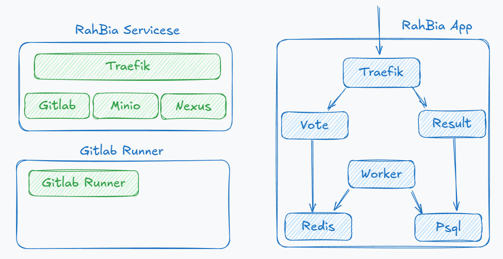

# Rahbia Live Coding
### Organized by DockerMe group
  - **Speaker:** [Ahmad Rafiee](https://www.linkedin.com/in/ahmad-rafiee)
  - **Date:** 19 February 2025
  - **Number of Sessions:** 14 (Session 15)

### Video Link:

### 🔴 Live Coding Session 15: Design and deploy voting app on docker

In Live Coding Session 15, we designed and deployed a Voting App on Docker. This application consists of multiple services, and we progressed up to the image build phase, utilizing the services we had previously set up.

#### 📌 Application Architecture
The Voting App consists of the following components:

  - **Frontend**: User interface for voting
  - **Backend**: Processes voting requests
  - **Database (PostgreSQL)**: Stores vote data
  - **Queue (Redis)**: Handles request queuing
  - **Worker**: Processes voting data

#### 🚀 Completed Steps
✅ Designed the Voting App Architecture
✅ Change Dockerfiles for each service
✅ Built images and reviewed container structure
✅ Create Compose file for build and push all service images
✅ Create Compose file setup and configure service

**Draw a High-Level Design (HLD) diagram of the services built and the path taken**

#### 📌 Next Steps
In the upcoming sessions, we will focus on full deployment with Docker Compose, managing networking and volumes, and ensuring a stable deployment.

### 📢 Stay tuned for the next steps! 🚀

## 🔗 Links

