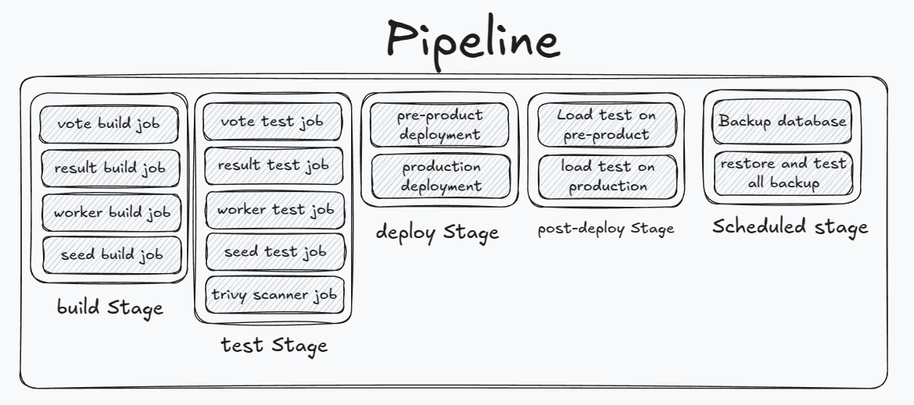

# Rahbia Live Coding
### Organized by DockerMe group
  - **Speaker:** [Ahmad Rafiee](https://www.linkedin.com/in/ahmad-rafiee)
  - **Date:** 26 February 2025
  - **Number of Sessions:** 16 (Session 16)

### Video Link:

### 🔴 Live Coding Session 15: Voting App Deployment on Docker

In Live Coding Session 16, This Session contains the deployment process of the Voting App using a traditional method, followed by an automated CI/CD pipeline for build and testing.

#### 📌 Application Architecture
The Voting App consists of multiple microservices that handle voting, result tallying, and backend operations. Initially, the deployment was done manually, and later, we implemented CI/CD pipelines to streamline the build and test process.
The Voting App consists of the following components:

  - **Frontend**: User interface for voting
  - **Backend**: Processes voting requests
  - **Database (PostgreSQL)**: Stores vote data
  - **Queue (Redis)**: Handles request queuing
  - **Worker**: Processes voting data

#### Technologies Used

  - **Docker:** Containerization of services
  - **Ansible:** Automation of deployment
  - **GitLab CI/CD:** Pipeline implementation for build and test automation
  - **Traefik:** Reverse proxy and load balancing
  - **PostgreSQL:** Database backend
  - **Redis:** In-memory data store for caching and messaging

#### Deployment Steps
  1. Traditional Deployment
    - Manually set up services using Docker Compose.
    - Configured database and cache layers.
    - Verified manual deployment.
  2. CI/CD Implementation
    - Defined GitLab CI/CD pipeline for automated builds.
    - Implemented testing stages before deployment.
    - Automated service deployment using Ansible.

#### 🚀 Completed Steps
✅ Designed the Voting App Architecture
✅ Change Dockerfiles for each service
✅ Built images and reviewed container structure
✅ Create Compose file for build and push all service images
✅ Create Compose file setup and configure service

**Draw a High-Level Design (HLD) diagram of pipeline**

#### 📌 Next Steps
In the upcoming sessions, we will focus on full deployment with Docker Compose, managing networking and volumes, and ensuring a stable deployment.

### 📢 Stay tuned for the next steps! 🚀

## 🔗 Links

