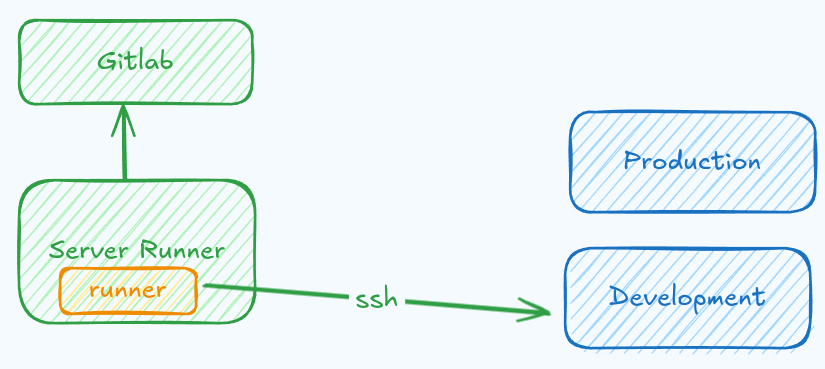

# Rahbia Live Coding
### Organized by DockerMe group
  - **Speaker:** [Ahmad Rafiee](https://www.linkedin.com/in/ahmad-rafiee)
  - **Date:** 06 May 2025
  - **Number of Sessions:** 17 (Session 17)

### Video Link:
[](https://www.youtube.com/live/RW6pWGH3BiM)

[](https://www.youtube.com/live/oUsnTQMRHIQ)


### 🔴 Live Coding Session 17: Voting App Deployment on Docker with gitlab CI/CD

In Live Coding Session 17, This Session contains the deployment process of the Voting App using CI/CD method, deploy to development stage.

#### 📌 Application Architecture
The Voting App consists of multiple microservices that handle voting, result tallying, and backend operations. Initially, the deployment was done manually, and later, we implemented CI/CD pipelines to streamline the build and test process.
The Voting App consists of the following components:

  - **Frontend**: User interface for voting
  - **Backend**: Processes voting requests
  - **Database (PostgreSQL)**: Stores vote data
  - **Queue (Redis)**: Handles request queuing
  - **Worker**: Processes voting data

#### Technologies Used

  - **Docker:** Containerization of services
  - **Ansible:** Automation of deployment
  - **GitLab CI/CD:** Pipeline implementation for build and test automation
  - **Traefik:** Reverse proxy and load balancing
  - **PostgreSQL:** Database backend
  - **Redis:** In-memory data store for caching and messaging


#### 🚀 Project directory and `gitlab-ci` deployment section

```bash
cicd/monorepo-voting-app
```

deployment section on gitlab-ci

```yaml
deploy-development:
  stage: deploy
  image: alpine:latest
  variables:
    main_domain: dev.app.rahbia.ir
    vote_domain: vote
    result_domain: result
    traefik_domain: tra
    server_address: 192.168.200.104
  before_script:
    - 'command -v ssh-agent >/dev/null || ( apk add --update --no-cache openssh )'
    - eval $(ssh-agent -s)
    - chmod 400 "$SSH_PRIVATE_KEY"
    - ssh-add "$SSH_PRIVATE_KEY"
    - mkdir -p ~/.ssh
    - chmod 700 ~/.ssh
  script:
    - |
      sed -i s/IMAGE_VERSION/${VERSION}/g .env
      sed -i s/DOMIAN_ADDRESS/${main_domain}/g .env
      cat .env | grep image_version
      
      ssh -o StrictHostKeyChecking=no -p ${server_port} ${server_user}@${server_address} "
      [[ -d ${service_dir} ]] || mkdir -p ${service_dir}
      docker network ls | grep web_net || docker network create web_net
      docker network ls | grep app_net || docker network create app_net
      "

      scp -o StrictHostKeyChecking=no -P${server_port} .env ${server_user}@${server_address}:${service_dir}/
      scp -o StrictHostKeyChecking=no -P${server_port} compose.yml ${server_user}@${server_address}:${service_dir}/

      ssh -o StrictHostKeyChecking=no -p ${server_port} ${server_user}@${server_address} "
      docker login ${CI_REGISTRY} --username ${CI_REGISTRY_USER} --password ${CI_REGISTRY_PASSWORD}
      cd ${service_dir}
      docker compose pull 
      docker compose up -d
      "
  environment:
    name: development
    url: https://${vote_domain}.${main_domain}
```


✅ Setup Development and production stage with Gitlab CI/CD


#### Deployment Steps

  1. CI/CD Implementation
    - Automated service deployment using gitlab CI/CD.


#### 🚀 Completed Steps

✅ Setup Development and production stage with Gitlab CI/CD

**Draw a High-Level Design (HLD) diagram of pipeline**



#### 📌 Next Steps
In the upcoming sessions, we will focus on full deployment with Docker Compose on production, managing networking and volumes, and pipeline efficiency.

### 📢 Stay tuned for the next steps! 🚀


## 🔗 Links
[](https://dockerme.ir/)
[](https://youtube.com/@dockerme)
[](https://www.linkedin.com/in/ahmad-rafiee/)
[](https://t.me/dockerme)
[](https://instagram.com/dockerme)