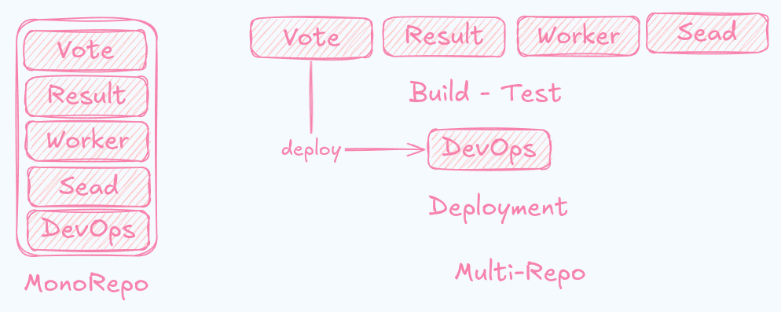
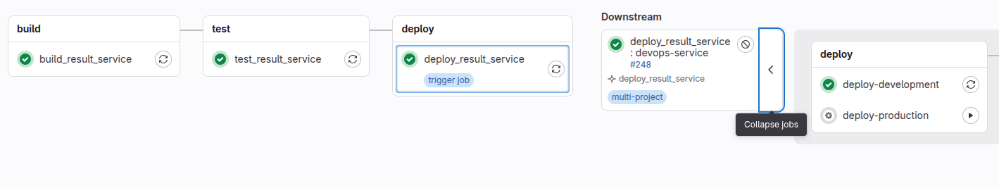
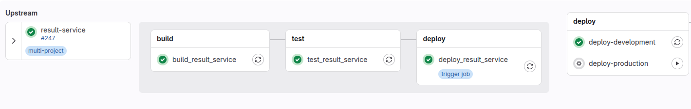

# Rahbia Live Coding

- [Rahbia Live Coding](#rahbia-live-coding)
  - [Organized by DockerMe group](#organized-by-dockerme-group)
  - [Video Link:](#video-link)
  - [🔴 Live Coding Session 27: Complete CI/CD multi-repo project](#-live-coding-session-27-complete-cicd-multi-repo-project)
  - [HLD Design](#hld-design)
  - [Pipeline box from result project (downstream)](#pipeline-box-from-result-project-downstream)
  - [Pipeline box from devops project (upstream)](#pipeline-box-from-devops-project-upstream)
  - [Config and test gitlab component and catalog](#config-and-test-gitlab-component-and-catalog)
  - [Pipeline and CI/CD](#pipeline-and-cicd)
  - [📌 Next Steps](#-next-steps)
  - [🔗 Stay connected with DockerMe! 🚀](#-stay-connected-with-dockerme-)


## Organized by DockerMe group
  - **Speaker:** [Ahmad Rafiee](https://www.linkedin.com/in/ahmad-rafiee)
  - **Date:** 2 September 2025
  - **Number of Sessions:** 27 (Session 27)

## Video Link:
[](https://www.youtube.com/live/q5Nzfxcve_c)

## 🔴 Live Coding Session 27: Complete CI/CD multi-repo project

In Live Coding Session 27, This Session complete create CI/CD multi-repo project 

## HLD Design


## Pipeline box from result project (downstream)


## Pipeline box from devops project (upstream)


## Config and test gitlab component and catalog


create and use security-scanning and test CI/CD catalog
all project in `gitlab-catalog/` directory

`security-scanner` catalog structure
```bash
security-scanner
├── .gitlab-ci.yml
├── README.md
└── templates
    └── scanner.yml
```

`test` catalog structure
```bash
test
├── .gitlab-ci.yml
├── README.md
└── templates
    └── amoo.yml
```

## Pipeline and CI/CD
all pipeline in `cicd/multirepo-voting-app` folder

```bash
.
├── devops-service
│   ├── compose.yml
│   ├── .env
│   └── .gitlab-ci.yml
│   └── minio
├── result-service
│   ├── docker-compose.test.yml
│   ├── Dockerfile
│   ├── .gitlab-ci.yml
│   ├── package.json
│   ├── package-lock.json
│   ├── server.js
│   ├── tests
│   └── views
├── seed-service
│   ├── Dockerfile
│   ├── generate-votes.sh
│   ├── .gitlab-ci.yml
│   └── make-data.py
├── vote-service
│   ├── app.py
│   ├── Dockerfile
│   ├── .gitlab-ci.yml
│   ├── requirements.txt
│   ├── static
│   └── templates
└── worker-service
    ├── Dockerfile
    ├── .gitlab-ci.yml
    ├── Program.cs
    └── Worker.csproj
```

## 📌 Next Steps

✅ Moving forward, we aim to complete these items and address them thoroughly:

  - Draw HLD diagrams of the monitoring services and the journey so far
  - Set up Prometheus stack on Docker for monitoring and alerting
  - Set up ELK stack on Docker for monitoring and logging
  - Set up Loki stack on Docker for logging
  - Set up Tempo stack on Docker for tracing
  - Review resource usage with monitoring tools
  - Analyze service logs with logging tools
  - Trace service requests using tracing tools

## 🔗 Stay connected with DockerMe! 🚀

**Subscribe to our channels, leave a comment, and drop a like to support our content. Your engagement helps us create more valuable DevOps and cloud content!** 🙌

[](https://dockerme.ir/) [](https://www.linkedin.com/in/ahmad-rafiee/) [](https://t.me/dockerme) [](https://youtube.com/@dockerme) [](https://instagram.com/dockerme)